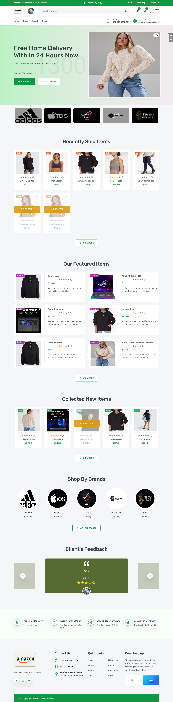
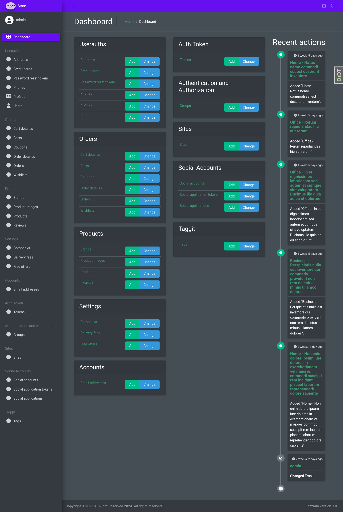

# 🛒 Django Ecommerce Store
Online store using python , django , rest framework , payment and more

## 🛒 Amazon Clone

## Description
The Amazon Clone is a fully functional e-commerce web application built using Python, Django, and the Django REST Framework. This project aims to replicate the core features of a typical online shopping platform, allowing users to browse products, manage their shopping carts, and process payments. The application includes user authentication, product management, and order processing, providing a comprehensive learning experience in web development.

## Tech Stack
    Frontend: JavaScript, HTML, CSS, SCSS
    Backend: Python, Django, Django REST Framework
    Database: SQLite (for development), PostgreSQL (for production)
    Caching: Redis
    Task Queue: Celery
    Payment Integration: Stripe
    Containerization: Docker
    Deployment: Docker Compose

## Getting Started
To run this project locally, follow these steps:

1.Clone the repository:

    git clone https://github.com/Islam412/Amazon-Clone.git
    cd Amazon-Clone

2.Set up a virtual environment:

    python -m venv venv
    source venv/bin/activate  # On Windows use `venv\Scripts\activate`

3.Install the requirements:

    pip install -r requirements.txt

4.Set up the database:

    python manage.py migrate

5.Create a superuser (optional):

    python manage.py createsuperuser

6.Run the development server:

    python manage.py runserver

7.Access the application:

    Open your browser and navigate to http://127.0.0.1:8000.

## project Demo

## Project Admin

Enjoy your shopping experience with Django Amazon Clone